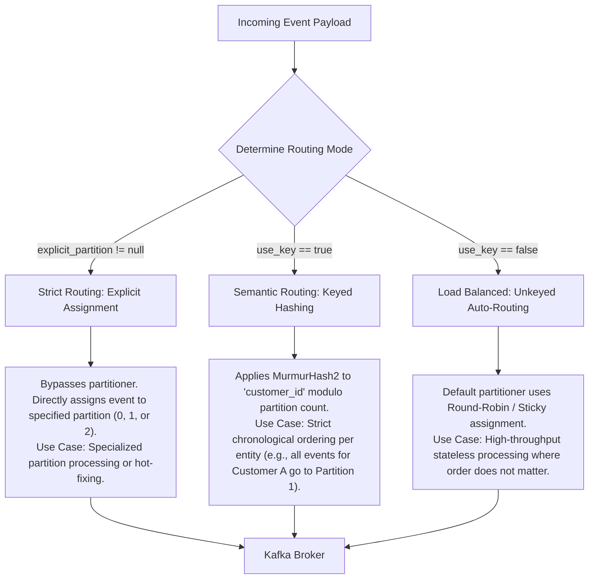
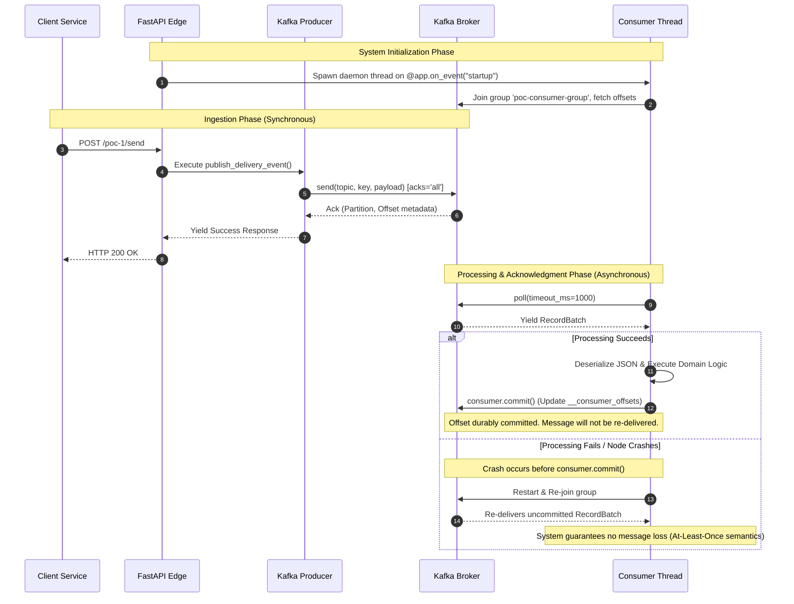

# Enterprise Event Streaming: Kafka POC-1 Architecture Guide

This comprehensive technical guide outlines the architecture, partition routing strategies, and message delivery guarantees implemented in **Kafka POC-1**. It serves as a production-grade reference for building resilient, event-driven microservices.

---

## 🏛️ 1. End-to-End System Architecture

The following diagram illustrates the complete lifecycle of a message, from ingestion via the FastAPI edge layer to storage in the Kafka broker, and finally to consumption and manual acknowledgment by the background worker thread.

```mermaid
graph TD
    Client["Edge Client / API Gateway"]
    
    subgraph FastAPI_Service["FastAPI Application Node"]
        Router["HTTP Router (router.py)"]
        Validation["Schema Validation (models.py)"]
        Producer["Producer Client (producer.py)"]
        Consumer["Consumer Thread (consumer.py)"]
        StateStore["In-Memory State Store (Thread-Safe deque)"]
    end
    
    subgraph Kafka_Cluster["Apache Kafka Cluster (KRaft Mode)"]
        Topic["Topic: poc-messages (3 Partitions)"]
        P0["Partition-0 (Leader)"]
        P1["Partition-1 (Leader)"]
        P2["Partition-2 (Leader)"]
        OffsetTopic["Internal Topic: __consumer_offsets"]
    end

    Client -->|1. POST JSON Payload| Router
    Router -->|2. Enforce Data Contract| Validation
    Validation -->|3. Dispatch| Producer
    
    Producer -->|4. Publish (acks='all')| Topic
    Topic -.-> P0
    Topic -.-> P1
    Topic -.-> P2

    P0 -.->|5. Poll Record Batch| Consumer
    P1 -.->|5. Poll Record Batch| Consumer
    P2 -.->|5. Poll Record Batch| Consumer
    
    Consumer -->|6. Execute Business Logic| StateStore
    Consumer -->|7. Manual ACK (consumer.commit)| OffsetTopic

    Client -->|8. GET State| StateStore
```

---

## 🔀 2. Partition Routing Strategies

In distributed systems, data locality and ordering guarantees are paramount. POC-1 implements three distinct routing algorithms to demonstrate how producers can govern data distribution across partitions.



---

## 🔄 3. Delivery Guarantees & Offset Management (Sequence Diagram)

To achieve **At-Least-Once Delivery** and prevent message loss during pod restarts or network failures, POC-1 explicitly disables auto-commits (`enable_auto_commit=False`) and relies on deterministic manual offset commits.



---

## ⚙️ 4. Technical Specifications & Configuration

| Subsystem | Parameter | Value | Production Rationale |
| :--- | :--- | :--- | :--- |
| **Kafka Broker** | `KAFKA_NUM_PARTITIONS` | `3` | Enables parallel consumption. Partitions are the fundamental unit of scaling in Kafka. |
| **Producer** | `acks` | `"all"` | Highest durability. The leader broker will wait for all in-sync replicas (ISRs) to acknowledge the message before responding to the producer. |
| **Producer** | `retries` | `3` | Mitigates transient network failures. Prevents immediate application failure during brief broker unavailability. |
| **Consumer** | `enable_auto_commit` | `False` | Prevents the consumer from automatically committing offsets in the background, which can lead to data loss if the application crashes before processing is complete. |
| **Consumer** | `auto_offset_reset` | `"earliest"` | If no previous offset exists for the consumer group, start reading from the very beginning of the partition log to avoid missing historical data. |
