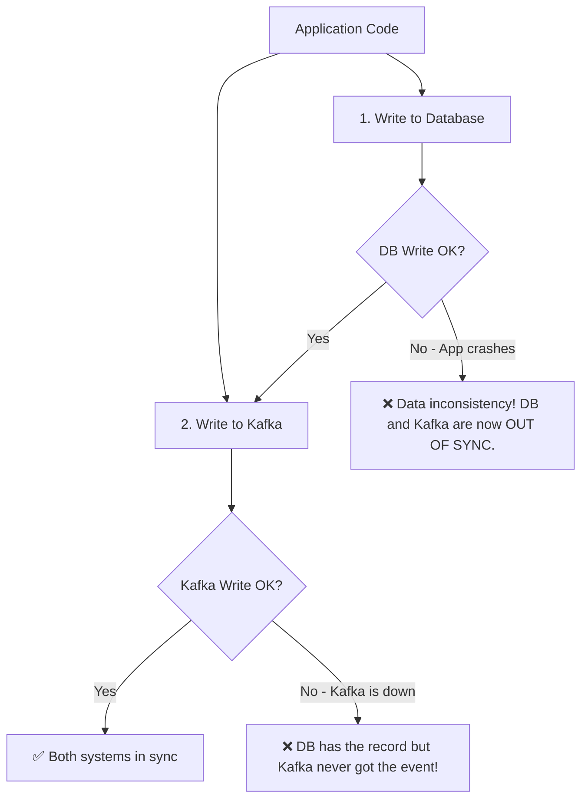
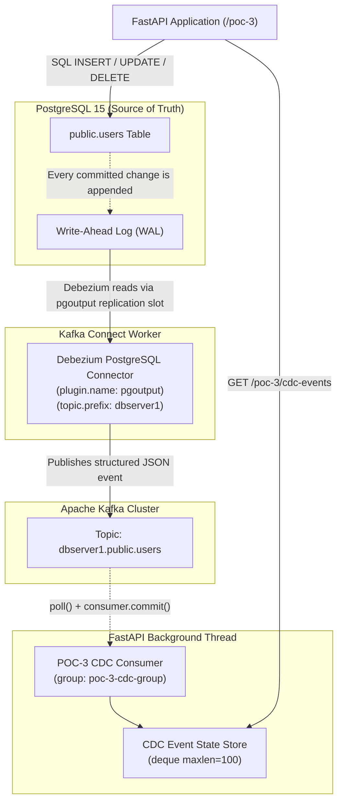
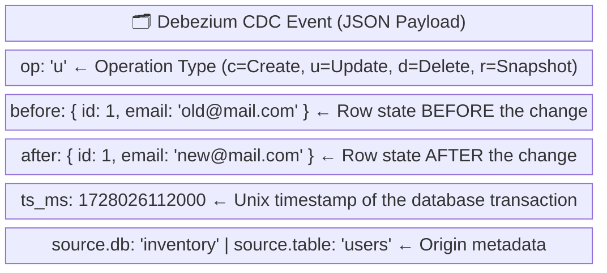
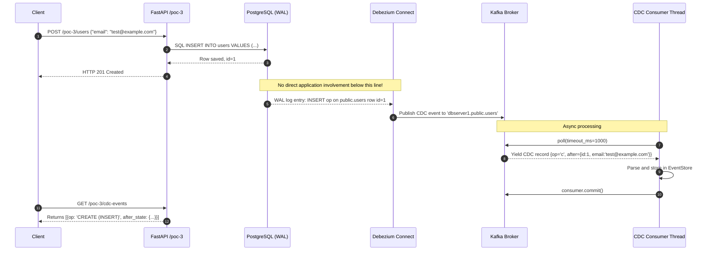

# Enterprise CDC Architecture: Debezium + PostgreSQL + Kafka

This guide explains the complete Change Data Capture (CDC) workflow in **Kafka POC-3**, including how Debezium connects to PostgreSQL, monitors database changes, and streams them into Apache Kafka automatically.

---

## 🛑 1. The Problem: The Dual-Write Anti-Pattern

In traditional systems, applications that need to both persist data and emit events face a **Dual-Write problem**.



**The Risk:** If the application crashes between step 1 and step 2, or if Kafka is temporarily unavailable, the database and the event stream are permanently out of sync with no way to recover.

---

## ✅ 2. The Solution: Debezium CDC Architecture

Debezium solves this by making the **database transaction log (WAL)** the single source of truth. The application only writes to PostgreSQL. Debezium watches the log and guarantees that every committed database change eventually reaches Kafka.



---

## 🔄 3. Debezium CDC Event Anatomy

Every event Debezium publishes to Kafka contains a structured JSON payload with critical metadata. For an `UPDATE`, both the row's old and new state are captured.



---

## 🔢 4. End-to-End Sequence Diagram (CREATE Example)



---

## 🧪 5. Step-by-Step Testing Guide

### Step 1: Start the System
```bash
docker compose up --build -d
```

### Step 2: Create a User (Triggers CDC INSERT)
```bash
curl -X POST http://localhost:8000/poc-3/users \
  -H "Content-Type: application/json" \
  -d '{"first_name": "Sahana", "last_name": "Thakkar", "email": "sahana@example.com"}'
```

### Step 3: Update the User (Triggers CDC UPDATE with before/after states)
```bash
curl -X PUT http://localhost:8000/poc-3/users/1 \
  -H "Content-Type: application/json" \
  -d '{"email": "sahana.updated@example.com"}'
```

### Step 4: Delete the User (Triggers CDC DELETE)
```bash
curl -X DELETE http://localhost:8000/poc-3/users/1
```

### Step 5: Inspect all CDC Events
```bash
curl http://localhost:8000/poc-3/cdc-events
```

Observe the `operation`, `before_state`, and `after_state` fields for each event!
